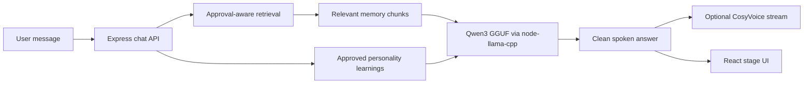
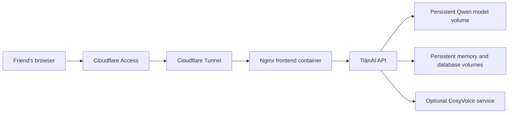

# TiānAI

[](https://github.com/maharab549/tianai/actions/workflows/ci.yml)
[](LICENSE)

TiānAI is a local-first family memory companion. It turns a family's approved messages, documents, photographs, recipes, and stories into a private conversational profile that can answer normally, recall relevant details, and speak in a learned family member's style.

The project runs on a personal computer today and is designed to move to a private server or Synology NAS later. A remote user opens the web interface through HTTPS; the server keeps the model, memory files, accounts, and voice services behind the deployment's private network. Text generation runs locally with an open GGUF model. No LM Studio, Ollama, hosted LLM API, or model API key is required.

## Product goals

TiānAI is built for families who want to preserve the way someone spoke, remembered things, told stories, or shared everyday knowledge. A typical installation can:

- Create a family and one or more represented family members.
- Import text, Markdown, CSV, JSON, HTML, DOCX, and PDF memories.
- Keep memories pending until a family administrator approves them.
- Answer general questions normally while using relevant personal context when it helps.
- Learn durable facts, preferred phrasing, boundaries, and repeatable family skills from explicit conversations.
- Speak through a live browser voice session and optionally use an approved reference voice.
- Give administrators role controls, consent records, audit history, learning review, export, and deletion tools.

TiānAI keeps personal memories as private background. The chat response is generated as a natural answer rather than a pasted memory citation or an internal retrieval message.

## Current status

The current release is a working local self-hosted application. It includes the responsive stage interface, authentication, memory vault, local Qwen inference, approval-aware retrieval, learning loop, live voice streaming route, a rigged WebGL VRM avatar with blend-shape lip sync, CosyVoice adapter, Docker files, tests, and Synology deployment documentation.

The default repository is a local JSON store and local filesystem. PostgreSQL, pgvector, and MinIO definitions are included in Compose and the SQL migration as the next storage adapter, but the default chat code does not yet depend on those services. This keeps local development simple while leaving a clear path to a multi-user server deployment.

## How a conversation works



1. The authenticated API identifies the selected family member and conversation.
2. Only approved memory embeddings for that member are considered.
3. Current retrieval combines deterministic local embeddings, lexical overlap, and relevance thresholds. The result is a small set of private context chunks.
4. Approved learning items provide personality and conversation guidance. They do not replace the source memory.
5. Qwen3 receives a structured prompt that separates general knowledge, personal context, and learned style.
6. The answer is cleaned before it reaches the interface or voice service. Internal labels, source disclosures, uncertainty boilerplate, and stage directions are removed.
7. A background learning reviewer can extract high-confidence durable items. When the configured threshold is reached, a private JSONL dataset and optional QLoRA job are created.

## Technical architecture

| Layer | Implementation | Responsibility |
| --- | --- | --- |
| Web client | React, TypeScript, Vite, Lucide | Stage UI, vault, chat, live microphone mode, admin screens |
| API | Express, TypeScript | Authentication, family roles, memory workflow, chat, voice, audit, metrics |
| Local LLM | Qwen3 `Q4_K_M` GGUF, `node-llama-cpp` | In-process text generation and learning review |
| Live avatar | Three.js, `@pixiv/three-vrm`, VRM 0/1 model | WebGL rendering, idle motion, blinking, and voice-driven mouth expressions |
| Memory processing | `mammoth`, `pdf-parse`, local parsers | Text extraction, chunking, metadata, approval state |
| Retrieval | Local deterministic embeddings plus lexical scoring | Relevant approved memory selection |
| Learning | JSONL export, Python QLoRA worker | Durable profile learning and optional adapter training |
| Voice | CosyVoice HTTP adapter, `ffmpeg` | Consent-controlled reference voice and streamed PCM audio |
| Persistence today | JSON repository and filesystem volumes | Local development and private single-host deployment |
| Persistence target | PostgreSQL/pgvector and MinIO | Scalable server storage adapter described by Compose and migrations |
| Remote access | Nginx, Cloudflare Tunnel, Cloudflare Access | HTTPS delivery without exposing backend or databases |

The repository is intentionally modular around the storage and voice provider boundaries. The local JSON store makes the project easy to run; the server roadmap replaces those boundaries with durable database, object-storage, worker, and queue implementations without changing the browser workflow.

## Run locally

### Requirements

- Node.js 20 or newer
- Windows, macOS, or Linux
- At least 3 GB of free disk space for the default model
- More memory improves model load time and response latency

### Install and start

```bash
git clone https://github.com/maharab549/tianai.git
cd tianai
npm install
npm --prefix backend install
npm --prefix frontend install
cp .env.example .env
npm run dev
```

On PowerShell, use `Copy-Item .env.example .env` instead of `cp`.

Open <http://localhost:5173>. The API health endpoint is <http://localhost:4000/api/health>. On first start, the backend downloads `Qwen3-4B-Q4_K_M.gguf` from Hugging Face into `backend/models` and loads it locally. The default download is approximately 2.5 GB.

For a smaller machine, set the Qwen3 0.6B model values shown in `.env.synology.example`. Any replacement model must be compatible with the `node-llama-cpp` GGUF runtime and its chat template.

The live stage includes a redistributable VRoid sample model at `frontend/public/avatars/avatar-sample-a.vrm`. It is loaded locally by the browser; no avatar CDN or external avatar API is required. Replace that file with a family-approved VRM model when deploying a personal representation. Review the model license before redistribution; see [THIRD_PARTY_NOTICES.md](THIRD_PARTY_NOTICES.md).

The seeded account is for local development only:

```text
Email:    demo@tianai.local
Password: demo1234
```

Create a new family account before sharing an installation.

## Move from local to a private server

The deployment model is the same application in a different environment:



For a Synology deployment:

1. Install Container Manager and clone or upload this repository.
2. Copy `.env.synology.example` to `.env` and replace every secret and public hostname placeholder.
3. Start the Compose stack with the `tunnel` profile.
4. Point the Cloudflare published application at `http://frontend:5173`.
5. Add a Cloudflare Access policy for the people who may use the service.
6. Create application accounts instead of sharing the development account.
7. Back up memory, database, upload, and model volumes before upgrades.

The complete runbook is [DEPLOY-SYNOLOGY.md](DEPLOY-SYNOLOGY.md). The default 4B model needs more memory than a stock 4 GB DS925+ configuration; use the smaller model or upgrade the NAS before treating it as the primary inference host.

For a larger server, the same containers can be deployed behind a reverse proxy or private load balancer. The production roadmap below covers the storage and worker changes needed before a public multi-family service.

## Configuration

Copy `.env.example` to `.env` for local development. Keep `.env` private.

| Variable | Purpose |
| --- | --- |
| `JWT_SECRET` | Signs user sessions. Use a long random value outside development. |
| `CLIENT_ORIGIN` | Allowed browser origin for the API. |
| `LOCAL_LLM_MODEL_DIR` | Persistent directory for GGUF models. |
| `LOCAL_LLM_MODEL_FILE` | GGUF filename loaded by the backend. |
| `LOCAL_LLM_MODEL_URL` | Download URL for the selected GGUF. |
| `LOCAL_LLM_GPU` | `auto`, `true`, or `false` native acceleration mode. |
| `LOCAL_LLM_CONTEXT_SIZE` | Prompt context window. Reduce it on memory-constrained hosts. |
| `COSYVOICE_URL` | Optional local CosyVoice server. |
| `DOCUMENT_PROCESSOR_URL` | Optional local `/extract` service for audio, video, and image transcription. |
| `LEARNING_AUTO_RETRAIN_THRESHOLD` | Approved learning count that creates a training job. |
| `TRAINING_PYTHON` | Python executable used by the optional QLoRA worker. |

## Memory, consent, and learning

Every uploaded memory begins as `pending`. A family administrator approves or rejects it before it can be retrieved. Voice synthesis and avatar rendering require separate active consent. Deleting a memory removes its chunks and dependent files and records an audit event.

The learning loop is deliberately separate from raw memory retrieval:

- Explicit statements can become fact, style, boundary, or skill candidates.
- The local reviewer requires high confidence and uses approved evidence.
- Approved items can shape future phrasing without replacing source documents.
- Administrators can inspect, approve, reject, export, or delete learning items.
- Once the threshold is reached, the system can prepare JSONL data for QLoRA training.

QLoRA training is not included in the default inference container. Install `backend/training/requirements.txt` in a separate Python environment and configure the converter only on a host with enough memory or GPU capacity.

## Voice and live conversation

The browser live mode uses speech recognition, pauses while TiānAI answers, and schedules streamed raw PCM chunks as they arrive. The VRM avatar renders continuously in WebGL and maps the current voice energy to its `aa`, `ih`, `ou`, `ee`, and `oh` facial expressions. Chrome or Edge microphone permission is required. Headphones reduce feedback.

For a consented cloned voice, run [CosyVoice](https://github.com/FunAudioLLM/CosyVoice), set `COSYVOICE_URL`, upload a clean 10–30 second single-speaker reference, approve voice consent, and enter the exact words spoken in the recording. TiānAI normalizes the sample with `ffmpeg` before synthesis. Without CosyVoice, the API returns a clearly labeled local fallback tone.

## API surface

The main authenticated routes are:

| Route | Purpose |
| --- | --- |
| `POST /api/auth/register-family` | Create a family and administrator. |
| `POST /api/auth/login` | Create a seven-day session token. |
| `GET /api/bootstrap` | Load the current family workspace. |
| `POST /api/memories` | Upload or create a memory. |
| `POST /api/memories/:id/approve` | Approve a pending memory. |
| `POST /api/chat/query` | Generate a complete local answer. |
| `POST /api/chat/query/stream` | Stream answer tokens through SSE. |
| `POST /api/voice/stream` | Stream consented voice PCM. |
| `GET /api/llm/status` | Check model download and load state. |
| `GET /api/learning` | Inspect learned profile items and jobs. |
| `GET /api/metrics` | Read administrator metrics. |

All routes except health and authentication require a JWT. Role checks apply to administration, approvals, learning changes, voice models, and governance actions.

## Docker Compose

```bash
cp .env.example .env
docker compose up --build
```

Compose defines the frontend, API, PostgreSQL, MinIO, and optional Cloudflare Tunnel services. In the current release the API persists to its local JSON and filesystem volumes; PostgreSQL and MinIO are the prepared path for the server storage adapter. Keep database and object-storage ports bound to loopback or the private Compose network.

## Development

```bash
npm run dev       # Start backend and frontend watchers
npm test          # Run backend tests
npm run build     # Build backend and frontend
npm start         # Start the compiled backend
```

Before opening a pull request, run `npm test` and `npm run build`. GitHub Actions repeats those checks on Node 20 and Node 22.

### Repository layout

```text
backend/src/index.ts       Express routes, auth, retrieval, chat, voice, audit, metrics
backend/src/llm.ts         GGUF loading, prompts, answer cleanup, learning review
backend/src/services.ts    Memory parsers and voice/avatar provider adapters
backend/src/store.ts       Local repository, embeddings, audit, and metrics
backend/tests/              Backend tests
backend/training/           Optional QLoRA training worker and requirements
backend/migrations/         PostgreSQL and pgvector schema foundation
frontend/src/AiriApp.tsx    Main stage interface
frontend/src/LiveAvatar.tsx Three.js VRM renderer and live facial animation
frontend/src/styles.css     Responsive visual system
frontend/public/avatars/    Local VRM avatar assets
docker-compose.yml          Local, NAS, and tunnel service definitions
DEPLOY-SYNOLOGY.md          Synology and Cloudflare deployment runbook
```

## Development roadmap

The roadmap describes the path from a strong private single-host application to a reliable shared server. Items are engineering milestones rather than promises of a hosted public service.

### Completed in the current release

- [x] Local Qwen3 GGUF inference without LM Studio or Ollama.
- [x] Approval-aware memory upload, parsing, chunking, and retrieval.
- [x] Natural general-question and personality-aware conversation flow.
- [x] Explicit learning extraction, review, export, and automatic training-job threshold.
- [x] Browser live voice mode and streamed voice API.
- [x] Consent, family roles, audit records, rate limiting, and security headers.
- [x] Docker, Synology, Cloudflare Tunnel, CI, and deployment documentation.

### Phase 1: Server persistence and operations

- [ ] Replace the JSON repository with PostgreSQL and pgvector behind the existing store boundary.
- [ ] Move uploads and model artifacts to S3-compatible object storage through the existing MinIO path.
- [ ] Add a durable job queue for parsing, voice synthesis, learning review, and QLoRA training.
- [ ] Add scheduled encrypted backups and restore verification.
- [ ] Add structured logs, request IDs, health probes, and administrator observability.

### Phase 2: Retrieval and model quality

- [ ] Add a stronger embedding model and configurable reranker for larger memory collections.
- [ ] Build an evaluation set for recall accuracy, first-person perspective, factuality, and response style.
- [ ] Generate compact per-member persona summaries instead of passing unrelated background chunks.
- [ ] Add model profiles for CPU-only NAS, desktop GPU, and server GPU deployments.
- [ ] Add prompt and adapter versioning so every response can be traced to a model configuration.

### Phase 3: Conversation and voice

- [ ] Add local VAD and streaming speech recognition for lower-latency turn detection.
- [ ] Support barge-in so a user can interrupt voice playback naturally.
- [ ] Add WebRTC audio transport for long conversations and mobile networks.
- [ ] Improve CosyVoice health checks, model caching, and per-member voice isolation.
- [ ] Add a voice quality and pronunciation test panel before a model is activated.

### Phase 4: Shared server readiness

- [ ] Add invitation lifecycle, email verification, password recovery, and optional passkeys.
- [ ] Add tenant-level quotas, storage limits, model concurrency controls, and abuse protection.
- [ ] Add administrator data export, account deletion, retention policies, and consent revocation workflows.
- [ ] Add rolling Docker updates with migrations, health gates, and automatic rollback documentation.
- [ ] Provide a supported server profile for CPU inference and a separate GPU inference profile.

## Privacy and security

TiānAI is intended for private, self-hosted use. Uploaded memories, model files, and voice references remain on the configured host unless an optional local adapter is enabled. Change every development credential before remote use, keep tunnel tokens private, use Cloudflare Access or an equivalent identity layer, and never expose ports `4000`, `5432`, `9000`, or `9001` directly to the public Internet.

Read [SECURITY.md](SECURITY.md) and [DEPLOY-SYNOLOGY.md](DEPLOY-SYNOLOGY.md) before using a public hostname. The service generates AI responses and should be presented clearly to users; it does not establish that a response is an original human message.

## License and acknowledgements

TiānAI source code is released under the [MIT License](LICENSE). Qwen3, `node-llama-cpp`, CosyVoice, React, Express, and Lucide retain their own licenses. The stage composition is inspired by Airi, and the included preview asset is attributed in [THIRD_PARTY_NOTICES.md](THIRD_PARTY_NOTICES.md).
