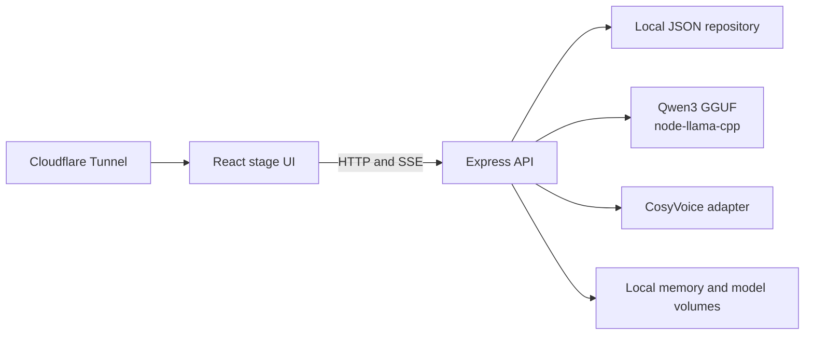

# TiānAI

TiānAI is a private family-memory companion that runs its language model locally. Families can upload approved memories, ask questions in a member's learned conversational style, use live voice chat, and optionally connect a consented voice model.

The application is designed for self-hosting. It does not require LM Studio, Ollama, a hosted LLM API, or an API key for text generation.

## Highlights

- Local Qwen3 GGUF inference through `node-llama-cpp`.
- Memory ingestion for text, Markdown, CSV, JSON, HTML, DOCX, and PDF files.
- Approval-aware retrieval so only approved memories reach a conversation.
- Personality and conversation learning from explicit, high-confidence statements.
- Optional automatic QLoRA dataset and retraining job generation.
- Live browser voice mode with streaming PCM playback.
- Optional CosyVoice zero-shot voice adapter with consent and reference-audio checks.
- JWT authentication, family roles, consent records, audit events, rate limiting, and Helmet security headers.
- Responsive Airi-inspired stage interface with a dedicated memory workspace.
- Docker Compose and Synology plus Cloudflare Tunnel deployment guides.

## Architecture



The current application uses a durable local JSON repository and filesystem storage. PostgreSQL, pgvector, and MinIO are included in Compose as an infrastructure path for a future repository adapter; the default chat service does not require them.

## Quick start

Requirements:

- Node.js 20 or newer
- Windows, macOS, or Linux
- About 3 GB of free disk space for the default model

```bash
git clone https://github.com/<owner>/tianai.git
cd tianai
npm install
npm --prefix backend install
npm --prefix frontend install
cp .env.example .env
npm run dev
```

Open <http://localhost:5173>. The API health endpoint is <http://localhost:4000/api/health>.

On first start, the backend downloads `Qwen3-4B-Q4_K_M.gguf` from Hugging Face into `backend/models` and loads it locally. The download is roughly 2.5 GB. To use a different compatible GGUF, set `LOCAL_LLM_MODEL_FILE` and `LOCAL_LLM_MODEL_URL` in `.env`. On a low-memory NAS, the Qwen3 0.6B configuration in `.env.synology.example` is a better starting point.

The seeded local account is intended for development only:

```text
Email:    demo@tianai.local
Password: demo1234
```

Create a new family account before exposing an installation to other people.

## Configuration

Copy `.env.example` to `.env` for local development. Never commit `.env`.

| Variable | Purpose |
| --- | --- |
| `JWT_SECRET` | Signs sessions. Use a long random value outside development. |
| `LOCAL_LLM_MODEL_DIR` | Persistent directory for GGUF models. |
| `LOCAL_LLM_MODEL_FILE` | GGUF filename loaded by the backend. |
| `LOCAL_LLM_MODEL_URL` | Download URL for the selected GGUF. |
| `LOCAL_LLM_GPU` | `auto`, `true`, or `false` for native acceleration. |
| `LOCAL_LLM_CONTEXT_SIZE` | Prompt context window. Reduce it on memory-constrained devices. |
| `COSYVOICE_URL` | Optional local CosyVoice service URL. |
| `DOCUMENT_PROCESSOR_URL` | Optional local `/extract` service for audio, video, and image transcription. |
| `LEARNING_AUTO_RETRAIN_THRESHOLD` | Number of approved learnings before a training job is created. |

## Memory and learning flow

1. Upload a memory or paste text into the vault.
2. Review and approve it as a family administrator.
3. TiānAI chunks the approved content and retrieves relevant details during chat.
4. The local model answers ordinary questions normally and uses relevant personal details to shape the response.
5. Explicit durable statements such as “remember that…” can become approved fact, style, boundary, or skill learnings.
6. When the configured learning threshold is reached, TiānAI writes a private JSONL dataset and can start a QLoRA training job.

Learning does not replace the source memories. New facts remain reviewable, exportable, and removable through the learning API. QLoRA training requires a separate Python environment and substantially more memory than CPU-only inference; see the training requirements under `backend/training`.

## Voice mode

The chat stage has a live voice control for supported Chromium browsers. It keeps speech recognition active, sends completed utterances to the chat API, pauses while the answer is spoken, schedules streamed PCM chunks, and resumes listening afterward.

For a cloned voice, run [CosyVoice](https://github.com/FunAudioLLM/CosyVoice) locally and set `COSYVOICE_URL`. Upload a clean 10–30 second single-speaker reference, approve voice consent, and provide the exact words spoken in the recording. TiānAI normalizes the reference audio with `ffmpeg` before synthesis. Without CosyVoice, the service uses a clearly labeled fallback tone.

## Docker Compose

```bash
cp .env.example .env
docker compose up --build
```

The default Compose services are:

- Frontend: `http://localhost:5173`
- Backend: `http://localhost:4000`
- PostgreSQL: `localhost:5432`
- MinIO: `localhost:9000` and `localhost:9001`

Model, database, memory, and uploaded-file data live in named Docker volumes. Do not publish the backend, database, or MinIO ports directly to the Internet.

## Synology and Cloudflare

See [DEPLOY-SYNOLOGY.md](DEPLOY-SYNOLOGY.md) for Container Manager, persistent volumes, Cloudflare Tunnel, Access policies, updates, and backups. The public route should point to the frontend container only; Nginx proxies `/api` and `/storage` internally.

The default 4B model needs more memory than a stock 4 GB DS925+ configuration. Upgrade the NAS memory or use the smaller Qwen3 0.6B values supplied in `.env.synology.example`. Keep the Cloudflare tunnel token, JWT secret, database password, and MinIO password private.

## Development commands

```bash
npm run dev       # Start backend and frontend watchers
npm test          # Run backend tests
npm run build     # Build backend and frontend
npm start         # Start the compiled backend
```

Backend-only commands are available through `npm --prefix backend ...`; frontend-only commands use `npm --prefix frontend ...`.

## Project layout

```text
backend/src/llm.ts       Local model loading, prompting, cleanup, and learning review
backend/src/index.ts     API routes, auth, retrieval, chat, voice, and audit events
backend/src/services.ts  Memory parsers and voice/avatar provider adapters
backend/tests/            Backend tests
backend/training/         Optional QLoRA training worker and requirements
frontend/src/AiriApp.tsx  Main stage interface
frontend/src/styles.css   Responsive visual system
docker-compose.yml        Local and NAS service definitions
DEPLOY-SYNOLOGY.md        Synology and Cloudflare deployment runbook
```

## Privacy and security

TiānAI is intended for private, self-hosted use. Uploaded memories and model files stay on the configured host unless an optional local adapter is enabled. Approval and consent checks are enforced before memory retrieval, voice synthesis, and avatar rendering. Review `.env.example`, change all development credentials, use Cloudflare Access for remote installations, and back up the data volumes securely.

Please read [SECURITY.md](SECURITY.md) before deploying on a public hostname.

## License and acknowledgements

TiānAI source code is released under the [MIT License](LICENSE). TiānAI uses and integrates open-source projects including Qwen3 GGUF, `node-llama-cpp`, CosyVoice, React, Express, and Lucide. Their own licenses remain applicable. The interface draws inspiration from the public Airi project; third-party assets and names retain their original ownership and license terms.
